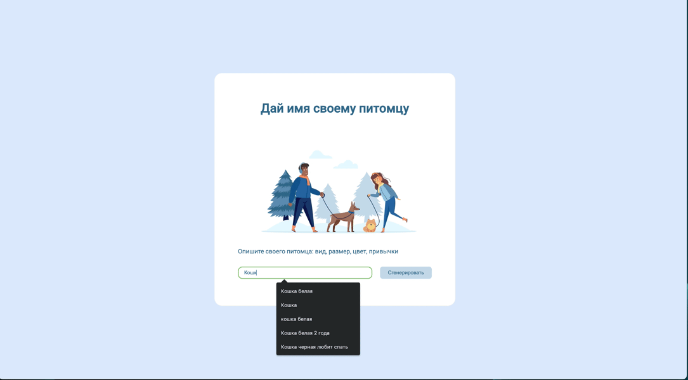

<!-- prettier-ignore-start -->

# Project Pets naming

[](/README.md)
[](/README.ru.md)

This project was written to try out the ChatGPT API

Visualization:



## Description

This application accesses the ChatGPT API and generates a name based on the description of the animal

## Usage

Dependencies must be installed in the root folder of the project:
:

```bash
npm install
```

Run the application locally in the root folder of the project:

```bash
node server.mjs
```

<!-- prettier-ignore-end -->
